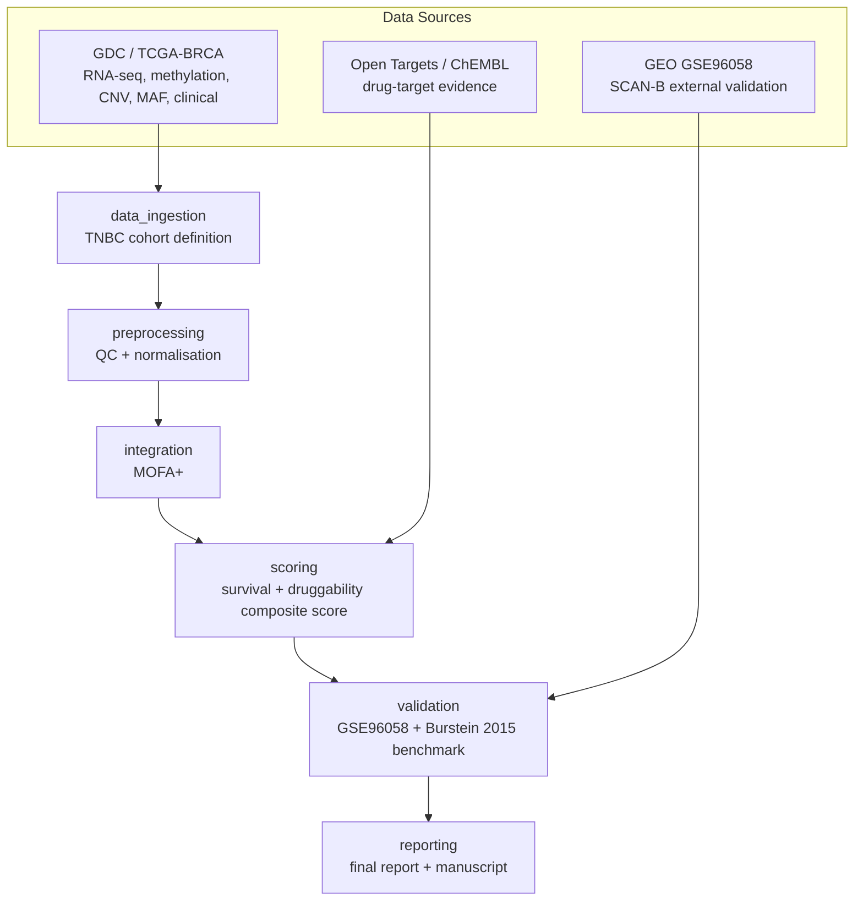

# OncoCartograph

**Integrative multi-omics biomarker prioritisation for triple-negative breast cancer (TNBC).**

> **Status: early scaffolding.** The repository structure, CI, and package
> skeleton are in place. The data ingestion, integration, scoring,
> validation, and reporting pipeline stages are being built incrementally,
> work package by work package (tracked via feature branches and PRs — see
> `CHANGELOG.md`). This README will be updated with real results and
> figures as each stage lands; sections below are marked explicitly where
> content is still pending so nothing here misrepresents current progress.

## Why TNBC, specifically

Triple-negative breast cancer (TNBC) — tumours that are ER-negative,
PR-negative, and HER2-negative — has the fewest approved targeted therapies
and the poorest 5-year survival of any breast cancer subtype. Most public
multi-omics integration demos run on TCGA pan-cancer or generic BRCA
cohorts without a rigorous, reproducible subtype definition, which limits
their clinical relevance and makes their biomarker calls hard to trust.

OncoCartograph instead:

1. Defines a **reproducible, auditable TNBC sub-cohort** from TCGA-BRCA
   using explicit, cited ER/PR/HER2 IHC/FISH thresholds (see
   `docs/methods.md` and `docs/adr/`), rather than an undocumented filter.
2. Integrates RNA-seq, DNA methylation, copy number, and somatic mutation
   data for that cohort with MOFA+.
3. Scores candidate biomarkers with a **standalone, unit-tested, versioned
   composite scoring package** (`src/oncocartograph/scoring/`) combining
   survival-association evidence with druggability evidence from Open
   Targets and ChEMBL.
4. **Benchmarks the pipeline against a published TNBC study** (Burstein et
   al. 2015, PMID 25208879) to demonstrate it reproduces known
   subtype-specific druggable targets before being trusted on novel
   candidates, and validates externally against the GSE96058 (SCAN-B)
   RNA-seq cohort.

## Architecture



## Quickstart

> Pending `feat/data-ingestion` and subsequent work packages. Real, tested
> commands will replace this section as each stage is implemented — see
> `CHANGELOG.md` for current status.

```bash
git clone https://github.com/NosakhareOsaro/oncocartograph.git
cd oncocartograph
python3.11 -m venv .venv && source .venv/bin/activate
pip install -e ".[dev]"
pre-commit install
pytest
```

## Pipeline DAG

Full DAG diagram (generated from the Snakemake workflow — see
`docs/adr/0002-workflow-engine-choice.md`) will be added once
`workflows/Snakefile` exists.

## Results

**Cohort (live GDC pull, 2026-07-20, Data Release 45.0):** of 1,097
TCGA-BRCA patients, **143 (13.0%) were classified as TNBC** under the
ADR 0001 rules. 954 excluded — 737 receptor-positive, 196 with a missing/
indeterminate IHC call, 21 HER2-equivocal-and-unresolved-by-FISH. Full
breakdown in `docs/methods.md` §1.2.

**Raw data ingested for the cohort:** 158 RNA-seq (STAR-Counts), 348
methylation (450K), 426 copy number (gene-level), and 126 mutation
(Masked Somatic Mutation) files — ~5.4 GB total, each with a checksummed
provenance sidecar. File counts exceed 143 because several patients have
multiple samples/aliquots; resolved to one Primary Tumor sample per
patient in `feat/preprocessing`.

**MOFA+ integration (2026-07-20):** trained on the preprocessed cohort
(copy number 2,000×142, RNA-seq 2,000×142, methylation 5,000×104,
mutation 845×122; 143 patients total via view union, no forced
complete-case subset). 12 of 15 factors clear a ≥2%-variance-explained
screening threshold. Two honest findings, not glossed over: Factor1 is
almost entirely copy-number-driven (56.5% CNV variance, <1.1% elsewhere)
and likely reflects broad genomic instability rather than shared
multi-omic biology; the mutation view contributes essentially no
variance to any factor (≤0.003%), so mutation-derived biomarkers will
need direct statistics rather than MOFA+ loadings. Full breakdown in
`docs/methods.md` §3.4.

**Composite scoring (2026-07-20):** 709 candidates screened against real
survival data (16 events). 0 survived FDR correction — expected given the
event count, documented as hypothesis-generating not confirmatory.
Running the real screen caught a genuine bug: lifelines can return
non-finite Cox statistics for sparse binary covariates, affecting 84%
(712/845) of mutation candidates, not the ~11% an initial NaN-only check
found. Full breakdown in `docs/methods.md` §4.4.

**Druggability evidence (2026-07-20):** real Open Targets + ChEMBL
evidence populated for 480/480 (100%) RNA-seq/copy-number/mutation
candidates (methylation's CpG-probe candidates deferred — need a
probe-to-gene mapping out of scope this iteration). Adding druggability
substantially reshuffled the ranking (Spearman ρ=0.656 vs. the
druggability-absent ranking; only 4/20 previous top candidates remained
in the top 20) — evidence the composite score does real work rather than
just re-deriving the survival ranking. The mutation-derived `TP53`
candidate ranked 7th overall, with real ChEMBL evidence
(`max_phase=3.0`) reflecting its genuine drug development history — a
candidate MOFA+ factor loadings could never have surfaced. Full
breakdown in `docs/methods.md` §6.5.

**External validation (2026-07-20):** the pre-registered primary
criterion — direction concordance between TCGA and GSE96058 (SCAN-B, a
real independent RNA-seq TNBC cohort, N=143, 26 events), tested against
chance with a one-sided exact binomial test at alpha=0.05, fixed *before*
the analysis was run — **failed**. Of 152 TCGA candidates, 109 had usable
GSE96058 evidence; only 45 (41.3%) were direction-concordant, below the
50% chance rate (p=0.973). This is consistent with the scoring package's
own 0/709 FDR-significant screen: there was no real signal in TCGA for
GSE96058 to replicate. The scope-reduced Burstein et al. (2015)
known-biology check (AR, PTEN, CD274, PDCD1, CTLA4 — not the full
LAR/MES/BLIS/BLIA subtyping) passed 5/5, a real but separate result that
does not offset the primary null finding. Reported honestly as a
limitation rather than reframed; full breakdown in `docs/methods.md` §5
and ADR 0009. Per-candidate evidence:
`data/processed/gse96058_replication_table.csv`.

## Reproducibility

Every intermediate artifact is traceable to an exact source
query/accession/download date (see `docs/data_sources.md`), and every
stochastic step logs its random seed. Exact commands to regenerate every
result from raw data will be listed here once the pipeline is complete.

## Documentation

- [`docs/methods.md`](docs/methods.md) — full methods write-up
- [`docs/data_sources.md`](docs/data_sources.md) — dataset accessions, versions, download dates, licenses
- [`docs/adr/`](docs/adr/) — architecture decision records
- [`docs/manuscript.md`](docs/manuscript.md) — preprint-style write-up
- [`docs/global_talent_evidence.md`](docs/global_talent_evidence.md) — evidence mapping

## How to cite

See [`CITATION.cff`](CITATION.cff).

## License

MIT — see [`LICENSE`](LICENSE).
