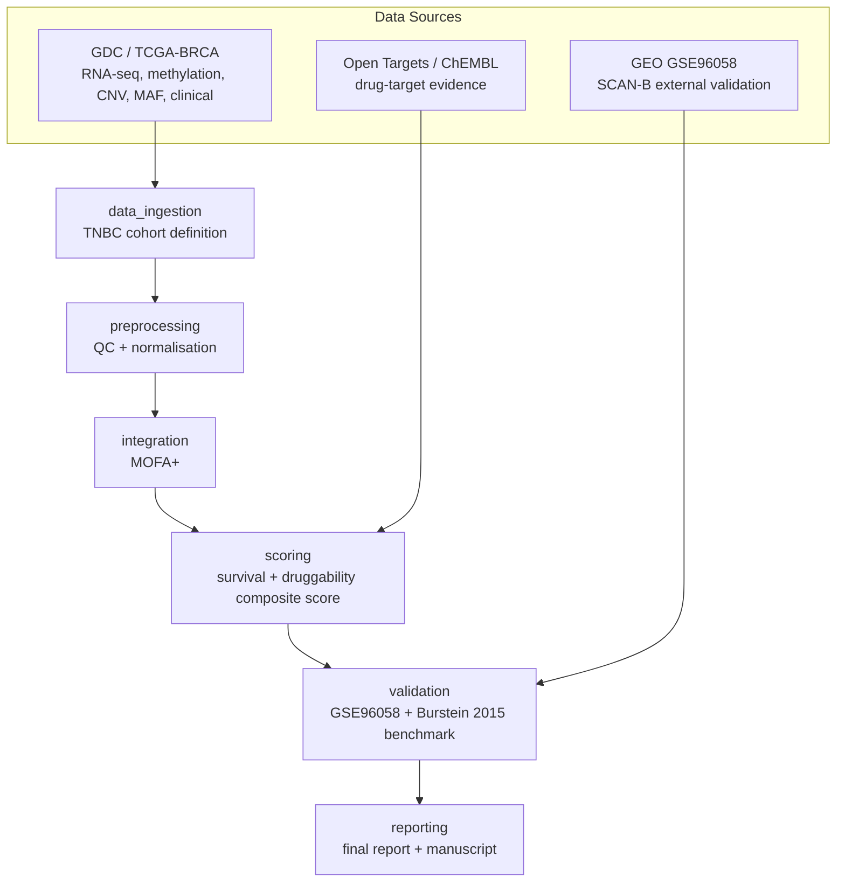

# OncoCartograph

**Integrative multi-omics biomarker prioritisation for triple-negative breast cancer (TNBC).**

> **Status: early scaffolding.** The repository structure, CI, and package
> skeleton are in place. The data ingestion, integration, scoring,
> validation, and reporting pipeline stages are being built incrementally,
> work package by work package (tracked via feature branches and PRs — see
> `CHANGELOG.md`). This README will be updated with real results and
> figures as each stage lands; sections below are marked explicitly where
> content is still pending so nothing here misrepresents current progress.

## Why TNBC, specifically

Triple-negative breast cancer (TNBC) — tumours that are ER-negative,
PR-negative, and HER2-negative — has the fewest approved targeted therapies
and the poorest 5-year survival of any breast cancer subtype. Most public
multi-omics integration demos run on TCGA pan-cancer or generic BRCA
cohorts without a rigorous, reproducible subtype definition, which limits
their clinical relevance and makes their biomarker calls hard to trust.

OncoCartograph instead:

1. Defines a **reproducible, auditable TNBC sub-cohort** from TCGA-BRCA
   using explicit, cited ER/PR/HER2 IHC/FISH thresholds (see
   `docs/methods.md` and `docs/adr/`), rather than an undocumented filter.
2. Integrates RNA-seq, DNA methylation, copy number, and somatic mutation
   data for that cohort with MOFA+.
3. Scores candidate biomarkers with a **standalone, unit-tested, versioned
   composite scoring package** (`src/oncocartograph/scoring/`) combining
   survival-association evidence with druggability evidence from Open
   Targets and ChEMBL.
4. **Benchmarks the pipeline against a published TNBC study** (Burstein et
   al. 2015, PMID 25208879) to demonstrate it reproduces known
   subtype-specific druggable targets before being trusted on novel
   candidates, and validates externally against the GSE96058 (SCAN-B)
   RNA-seq cohort.

## Architecture



## Quickstart

> Pending `feat/data-ingestion` and subsequent work packages. Real, tested
> commands will replace this section as each stage is implemented — see
> `CHANGELOG.md` for current status.

```bash
git clone <repo-url>
cd oncocartograph
python3.11 -m venv .venv && source .venv/bin/activate
pip install -e ".[dev]"
pre-commit install
pytest
```

## Pipeline DAG

Full DAG diagram (generated from the Snakemake workflow — see
`docs/adr/0002-workflow-engine-choice.md`) will be added once
`workflows/Snakefile` exists.

## Results

*Pending.* Populated once the integration, scoring, and validation work
packages are complete. No placeholder figures or numbers are included here
— this section will only ever show real pipeline output.

## Reproducibility

Every intermediate artifact is traceable to an exact source
query/accession/download date (see `docs/data_sources.md`), and every
stochastic step logs its random seed. Exact commands to regenerate every
result from raw data will be listed here once the pipeline is complete.

## Documentation

- [`docs/methods.md`](docs/methods.md) — full methods write-up
- [`docs/data_sources.md`](docs/data_sources.md) — dataset accessions, versions, download dates, licenses
- [`docs/adr/`](docs/adr/) — architecture decision records
- [`docs/manuscript.md`](docs/manuscript.md) — preprint-style write-up
- [`docs/global_talent_evidence.md`](docs/global_talent_evidence.md) — evidence mapping

## How to cite

See [`CITATION.cff`](CITATION.cff).

## License

MIT — see [`LICENSE`](LICENSE).
